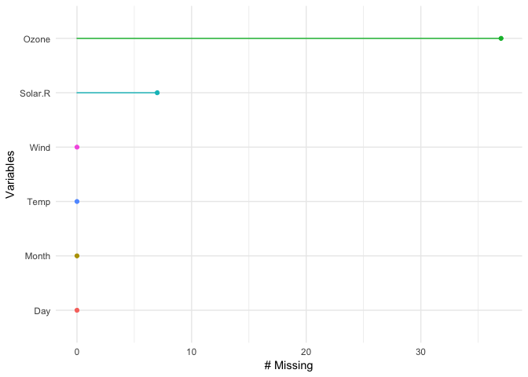
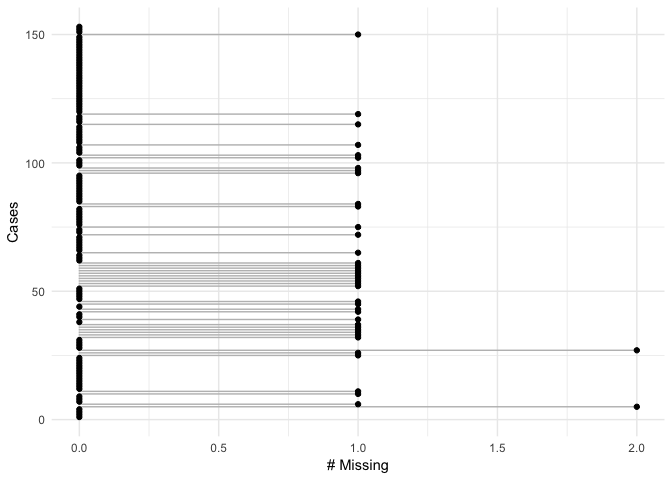

<!-- README.md is generated from README.Rmd. Please edit that file -->
naniar
======

[](https://ci.appveyor.com/project/njtierney/naniar) [](https://travis-ci.org/njtierney/naniar)

`naniar` helps open the door (or wardrobe) to a crazy world where there are tools to handle missings (NAs). At the moment it provides functions to:

-   Visualise missingness by adding a ggplot `geom`, `geom_missing_point`
-   Provide numerical summaries of missingness
-   Create summary plots of missingness (`gg_missing_var`)
-   convert and manipulate dataframes with metadata about missing values added.

`naniar` was previously nammed `ggmissing`, but was changed to `naniar` to reflect the fact that this package is going to be bigger in scope.

Why?
----

Missing data is ubiquitous in data analysis. However, vis points are omitted in ggplot, and although it does provides a warning message telling you that you have missing data, it is tricky to visualise missing data.

`naniar` aims to functions that play well with missing data representations in the predictable fashion, like in the tidyverse. In the future it will provide functions focussing on how to tidy, transform, visualise, model, and communicate missing data.

It is still very much under development, and may have unknown bugs, due to things like the fact that ggplot was not initially built to handle missing data in this way.

Please note that this project is released with a [Contributor Code of Conduct](CONDUCT.md). By participating in this project you agree to abide by its terms.

What does it do?
----------------

`naniar` provides:

1.  Missing data geoms for ggplot (`geom_missing_point`)

2.  Tidyverse summary functions for missing data (`summarise_missingness` and friends)

3.  ggplots for exploring missing data (`gg_missing_var`, `gg_missing_case`, `gg_missing_which`)

Using naniar
------------

### How does it work?

Plotting missing data might sound a little strange - how do you visualise something that is not there? In the past, GGobi and Manet have provided methods of visualising missingness, with one approach being to replace "NA" values with values 10% lower than the minimum value in that variable.

To illustrate, let's explore the relationship between Ozone and Solar radiation from the airquality dataset.

``` r
library(naniar)
# devtools::install_github("njtierney/naniar")
library(ggplot2)
library(dplyr)
#> 
#> Attaching package: 'dplyr'
#> The following objects are masked from 'package:stats':
#> 
#>     filter, lag
#> The following objects are masked from 'package:base':
#> 
#>     intersect, setdiff, setequal, union
```

``` r

ggplot(data = airquality,
       aes(x = Ozone,
           y = Solar.R)) +
  geom_point()
#> Warning: Removed 42 rows containing missing values (geom_point).
```


We get a little message, warning us about the missing values.

We can instead use the `geom_missing_point()` to display the missing data

``` r

library(naniar)
library(ggplot2)

ggplot(data = airquality,
       aes(x = Ozone,
           y = Solar.R)) +
  geom_missing_point()
```


`geom_missing_point()` has shifted the missing values to now be 10% below the minimum value. The missing values are a different colour so that missingness becomes preattentive.

This plays nicely with other parts of ggplot, like faceting - we can split the facet by month:

``` r
p1 <-
ggplot(data = airquality,
       aes(x = Ozone,
           y = Solar.R)) + 
  geom_missing_point() + 
  facet_wrap(~Month, ncol = 2) + 
  theme(legend.position = "bottom")

p1
```


And then change the theme, just like you do with any other ggplot graphic

``` r

p1 + theme_bw()  
```


Missing data tidying functions
==============================

`naniar` uses some missingness transformation functions to set up tables for visualisation.

``` r

# overall percentage of missing data
percent_missing_df(airquality)
#> [1] 4.793028

# % of variables that contain missing data
percent_missing_var(airquality)
#> [1] 33.33333

# % of cases that contain missing data
percent_missing_case(airquality)
#> [1] 27.45098

# tabulations of missing data across cases
table_missing_case(airquality)
#> # A tibble: 3 × 3
#>   n_missing_in_case n_cases  percent
#>               <int>   <int>    <dbl>
#> 1                 0     111 72.54902
#> 2                 1      40 26.14379
#> 3                 2       2  1.30719

# tabulations of missing data across variables
table_missing_var(airquality)
#> # A tibble: 3 × 3
#>   n_missing_in_var n_vars  percent
#>              <int>  <int>    <dbl>
#> 1                0      4 66.66667
#> 2                7      1 16.66667
#> 3               37      1 16.66667

# summary information (counts, percentrages) of missing data for variables and cases
summary_missing_var(airquality)
#> # A tibble: 6 × 3
#>   variable n_missing   percent
#>      <chr>     <int>     <dbl>
#> 1    Ozone        37 24.183007
#> 2  Solar.R         7  4.575163
#> 3     Wind         0  0.000000
#> 4     Temp         0  0.000000
#> 5    Month         0  0.000000
#> 6      Day         0  0.000000
summary_missing_case(airquality)
#> # A tibble: 153 × 3
#>     case n_missing  percent
#>    <int>     <int>    <dbl>
#> 1      1         0  0.00000
#> 2      2         0  0.00000
#> 3      3         0  0.00000
#> 4      4         0  0.00000
#> 5      5         2 33.33333
#> 6      6         1 16.66667
#> 7      7         0  0.00000
#> 8      8         0  0.00000
#> 9      9         0  0.00000
#> 10    10         1 16.66667
#> # ... with 143 more rows
```

Each of these functions can also be called all together using `summarise_missingness`, which takes a `data.frame` and then returns a nested dataframe containing the percentages of missing data, and lists of dataframes containing tally and summary information for the variables and cases.

``` r

s_miss <- summarise_missingness(airquality)

s_miss
#> # A tibble: 1 × 7
#>   percent_missing_df percent_missing_var percent_missing_case
#>                <dbl>               <dbl>                <dbl>
#> 1           4.793028            33.33333             27.45098
#> # ... with 4 more variables: table_missing_case <list>,
#> #   table_missing_var <list>, summary_missing_var <list>,
#> #   summary_missing_case <list>

# overall % missing data
s_miss$percent_missing_df
#> [1] 4.793028

# % of variables that contain missing data
s_miss$percent_missing_var
#> [1] 33.33333

# % of cases that contain missing data
s_miss$percent_missing_case
#> [1] 27.45098

# tabulations of missing data across cases
s_miss$table_missing_case
#> [[1]]
#> # A tibble: 3 × 3
#>   n_missing_in_case n_cases  percent
#>               <int>   <int>    <dbl>
#> 1                 0     111 72.54902
#> 2                 1      40 26.14379
#> 3                 2       2  1.30719

# tabulations of missing data across variables
s_miss$table_missing_var
#> [[1]]
#> # A tibble: 3 × 3
#>   n_missing_in_var n_vars  percent
#>              <int>  <int>    <dbl>
#> 1                0      4 66.66667
#> 2                7      1 16.66667
#> 3               37      1 16.66667

# summary information (counts, percentrages) of missing data for variables and cases
s_miss$summary_missing_var
#> [[1]]
#> # A tibble: 6 × 3
#>   variable n_missing   percent
#>      <chr>     <int>     <dbl>
#> 1    Ozone        37 24.183007
#> 2  Solar.R         7  4.575163
#> 3     Wind         0  0.000000
#> 4     Temp         0  0.000000
#> 5    Month         0  0.000000
#> 6      Day         0  0.000000
s_miss$summary_missing_case
#> [[1]]
#> # A tibble: 153 × 3
#>     case n_missing  percent
#>    <int>     <int>    <dbl>
#> 1      1         0  0.00000
#> 2      2         0  0.00000
#> 3      3         0  0.00000
#> 4      4         0  0.00000
#> 5      5         2 33.33333
#> 6      6         1 16.66667
#> 7      7         0  0.00000
#> 8      8         0  0.00000
#> 9      9         0  0.00000
#> 10    10         1 16.66667
#> # ... with 143 more rows
```

Other plotting functions
========================

These dataframes from the tidying functions are then used in these plots

gg\_missing\_var
----------------

``` r

gg_missing_var(airquality)
```


gg\_missing\_case
-----------------

``` r

gg_missing_case(airquality)
```



gg\_missing\_which
------------------

This shows whether a given variable contains a missing variable. In this case grey = missing. Think of it as if you are shading the cell in, if it contains data.

``` r

gg_missing_which(airquality)
```


Heatmap of missing data
-----------------------

I recommend the use of the `vis_miss` function from the [`visdat`](github.com/njtierney/visdat) package.

``` r

# devtools::install_github("njtierney/visdat")
library(visdat)
vis_miss(airquality)
```



Future Work
===========

`naniar` will be undergoing more changes over the next 6 months, with plans to have the package in CRAN before the end of 2016.

As such, we plan to extend the `geom_missing` family to include:

-   1D, univariate distribution plots
-   Categorical variables
-   Bivariate plots: Scatterplots, Density overlays.

We might possibly move the `summarise_missingness` functions into a separate package.

There are other utility functions:

-   `shadow_shift`, which shifts missing values to 10% below minimum
