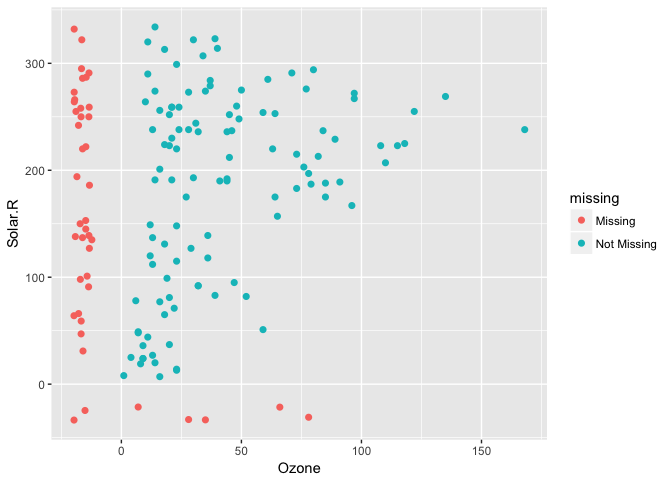
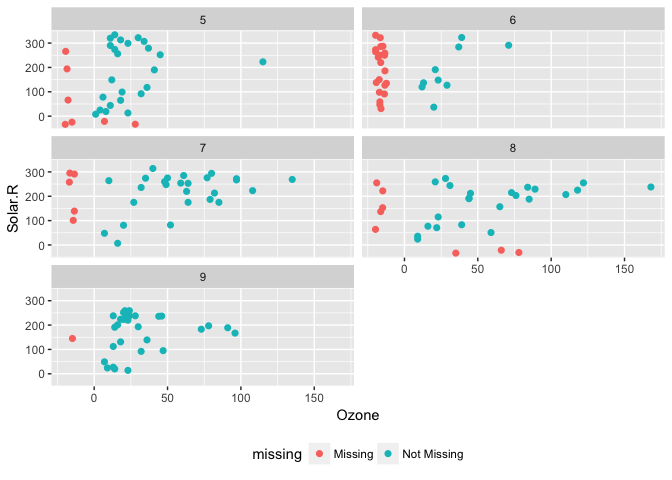
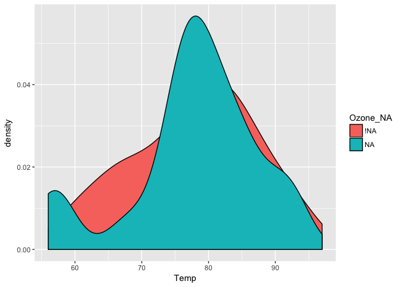
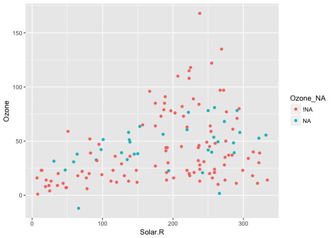
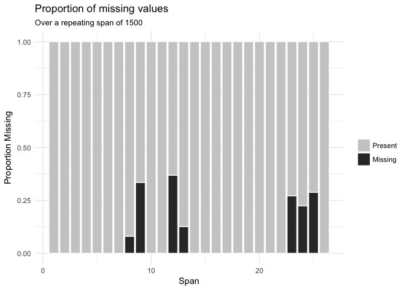

<!-- README.md is generated from README.Rmd. Please edit that file -->
naniar
======

[](https://ci.appveyor.com/project/njtierney/naniar) [](https://travis-ci.org/njtierney/naniar) [](https://codecov.io/github/njtierney/naniar?branch=master)

`naniar` aims to make it easy to summarise, visualise, and manipulate missing data with minimal deviations from the workflows in ggplot2 and tidy data.

Currently it provides:

-   Data structures for missing data
    -   `as_shadow()`
    -   `bind_shadow()`
    -   `gather_shadow()`
    -   `is_na()`
-   Visualisation methods:
    -   `geom_miss__point()`
    -   `gg_miss_var()`
    -   `gg_miss_case()`
    -   `gg_miss_which()`
-   Numerical summaries:
    -   `n_miss()`
    -   `n_complete()`
    -   `miss_case_pct()`
    -   `miss_case_summary()`
    -   `miss_case_table()`
    -   `miss_var_pct()`
    -   `miss_var_summary()`
    -   `miss_var_table()`
    -   `miss_df_pct()`

For details on how to use each of these functions, and their usage, you can read the vignette ["Getting Started with naniar"](http://www.njtierney.com/naniar/articles/getting-started-w-naniar.html).

**Why `naniar`?**

`naniar` was previously named `ggmissing` and initially provided a ggplot geom and some visual summaries. It was changed to `naniar` to reflect the fact that this package is going to be bigger in scope, and is not just related to ggplot2. Specifically, the package is designed to provide a suite of tools for generating visualisations of missing values and imputations, manipulate, and summarise missing data.

> ...But *why* `naniar`?

Well, I think it is useful to think of missing values in data being like this other dimension, perhaps like [C.S. Lewis's naniar](https://en.wikipedia.org/wiki/The_Chronicles_of_naniar) - a different world, hidden away. You go inside, and sometimes it seems like you've spent no time in there but time has passed very quickly, or the opposite. Also, `NA`rnia = na in r, and if you so desire, naniar may sound like "noneoya" in an nz/aussie accent. Full credit to @MilesMcbain for the name.

Please note that this project is released with a [Contributor Code of Conduct](CONDUCT.md). By participating in this project you agree to abide by its terms.

Data structures for missing data
================================

Representing missing data structure is achieved using the shadow matrix, introduced in [Swayne and Buja](https://www.researchgate.net/publication/2758672_Missing_Data_in_Interactive_High-Dimensional_Data_Visualization). The shadow matrix is the same dimension as the data, and consists of binary indicators of missingness of data values, where missing is represented as "NA", and not missing is represented as "!NA". Although these may be represented as 1 and 0, respectively. This representation can be seen in the figure below, adding the suffix "\_NA" to the variables. This structure can also be extended to allow for additional factor levels to be created. For example 0 indicates data presence, 1 indicates missing values, 2 indicates imputed value, and 3 might indicate a particular type or class of missingness, where reasons for missingness might be known or inferred. The data matrix can also be augmented to include the shadow matrix, which facilitates visualisation of univariate and bivariate missing data visualisations. Another format is to display it in long form, which facilitates heatmap style visualisations. This approach can be very helpful for giving an overview of which variables contain the most missingness. Methods can also be applied to rearrange rows and columns to find clusters, and identify other interesting features of the data that may have previously been hidden or unclear.


**Illustration of data structures for facilitating visualisation of missings and not missings**

Visualising missing data
========================

Visualising missing data might sound a little strange - how do you visualise something that is not there? One approach to visualising missing data comes from ggobi and manet, where we replace "NA" values with values 10% lower than the minimum value in that variable. This is provided with the `geom_miss_point()` ggplot2 geom, which we can illustrate by exploring the relationship between Ozone and Solar radiation from the airquality dataset.

``` r

library(ggplot2)

ggplot(data = airquality,
       aes(x = Ozone,
           y = Solar.R)) +
  geom_point()
#> Warning: Removed 42 rows containing missing values (geom_point).
```


ggplot2 does not handle these missing values, and we get a warning message about the missing values.

We can instead use the `geom_miss_point()` to display the missing data

``` r

library(naniar)

ggplot(data = airquality,
       aes(x = Ozone,
           y = Solar.R)) +
  geom_miss_point()
```



`geom_miss_point()` has shifted the missing values to now be 10% below the minimum value. The missing values are a different colour so that missingness becomes pre-attentive.

This plays nicely with other parts of ggplot, like adding transparency

``` r

ggplot(data = airquality,
       aes(x = Ozone,
           y = Solar.R)) +
  geom_miss_point(alpha = 0.5)
```


Thanks to Luke Smith for making this pull request.

We can also add features such as faceting, just like any regular ggplot plot.

For example, we can split the facet by month:

``` r

p1 <-
ggplot(data = airquality,
       aes(x = Ozone,
           y = Solar.R)) + 
  geom_miss_point() + 
  facet_wrap(~Month, ncol = 2) + 
  theme(legend.position = "bottom")

p1
```



And then change the theme, just like you do with any other ggplot graphic

``` r

p1 + theme_bw()  
```


You can also look at the proportion of missings in each variable with gg\_miss\_var:

``` r

gg_miss_var(airquality)
```


The plots created with the `gg_miss` family all have a basic theme, but you can customise them, just like usual ggplot objects. If you call any ggplot customisation functions with a `gg_miss` object, the default args will be overridden.

``` r
gg_miss_var(airquality) + theme_bw() 
```



``` r

gg_miss_var(airquality) + labs(y = "Look at all the missing ones")
```


You can also explore the whole dataset of missings using the `vis_miss` function, which is exported from the [`visdat`](github.com/njtierney/visdat) package.

``` r

vis_miss(airquality)
```


Another approach can be to use **Univariate plots split by missingness**. We can do this using the `bind_shadow()` argument to place the data and shadow side by side. This allows for us to examine univariate distributions according to the presence or absence of another variable.

``` r

aq_shadow <- bind_shadow(airquality)

aq_shadow
#> # A tibble: 153 x 12
#>    Ozone Solar.R  Wind  Temp Month   Day Ozone_NA Solar.R_NA Wind_NA
#>    <int>   <int> <dbl> <int> <int> <int>   <fctr>     <fctr>  <fctr>
#>  1    41     190   7.4    67     5     1      !NA        !NA     !NA
#>  2    36     118   8.0    72     5     2      !NA        !NA     !NA
#>  3    12     149  12.6    74     5     3      !NA        !NA     !NA
#>  4    18     313  11.5    62     5     4      !NA        !NA     !NA
#>  5    NA      NA  14.3    56     5     5       NA         NA     !NA
#>  6    28      NA  14.9    66     5     6      !NA         NA     !NA
#>  7    23     299   8.6    65     5     7      !NA        !NA     !NA
#>  8    19      99  13.8    59     5     8      !NA        !NA     !NA
#>  9     8      19  20.1    61     5     9      !NA        !NA     !NA
#> 10    NA     194   8.6    69     5    10       NA        !NA     !NA
#> # ... with 143 more rows, and 3 more variables: Temp_NA <fctr>,
#> #   Month_NA <fctr>, Day_NA <fctr>
```

The plot below shows the values of temperature when ozone is present and missing, on the left is a faceted histogram, and on the right is an overlaid density.

``` r

library(ggplot2)

p1 <- ggplot(data = aq_shadow,
       aes(x = Temp)) + 
  geom_histogram() + 
  facet_wrap(~Ozone_NA,
             ncol = 1)

p2 <- ggplot(data = aq_shadow,
       aes(x = Temp,
           colour = Ozone_NA)) + 
  geom_density() 

gridExtra::grid.arrange(p1, p2, ncol = 2)
#> `stat_bin()` using `bins = 30`. Pick better value with `binwidth`.
```


Numerical summaries for missing data
====================================

`naniar` provides numerical summaries of missing data. For variables, cases, and dataframes there are the function families `miss_var_*`, `miss_case_*`, and `miss_df_*`. To find the percent missng variables, cases, and dataframes:

``` r

# Proportion of variables that contain any missing values
miss_var_pct(airquality)
#> [1] 33.33333
 # Proportion of cases that contain any missing values
miss_case_pct(airquality)
#> [1] 27.45098
# Proportion elements in dataset that contains missing values
miss_df_pct(airquality)
#> [1] 0.04793028
```

We can also look at the number and percent of missings in each case and variable with `miss_var_summary()`, and `miss_case_summary()`.

``` r

miss_var_summary(airquality)
#> # A tibble: 6 x 3
#>   variable n_missing   percent
#>      <chr>     <int>     <dbl>
#> 1    Ozone        37 24.183007
#> 2  Solar.R         7  4.575163
#> 3     Wind         0  0.000000
#> 4     Temp         0  0.000000
#> 5    Month         0  0.000000
#> 6      Day         0  0.000000
miss_case_summary(airquality)
#> # A tibble: 153 x 3
#>     case n_missing  percent
#>    <int>     <int>    <dbl>
#>  1     5         2 33.33333
#>  2    27         2 33.33333
#>  3     6         1 16.66667
#>  4    10         1 16.66667
#>  5    11         1 16.66667
#>  6    25         1 16.66667
#>  7    26         1 16.66667
#>  8    32         1 16.66667
#>  9    33         1 16.66667
#> 10    34         1 16.66667
#> # ... with 143 more rows
```

Tabulations of the number of missings in each case or variable can be calculated with `miss_var_table()` and `miss_case_table()`.

``` r

miss_var_table(airquality)
#> # A tibble: 3 x 3
#>   n_missing_in_var n_vars  percent
#>              <int>  <int>    <dbl>
#> 1                0      4 66.66667
#> 2                7      1 16.66667
#> 3               37      1 16.66667
miss_case_table(airquality)
#> # A tibble: 3 x 3
#>   n_missing_in_case n_cases  percent
#>               <int>   <int>    <dbl>
#> 1                 0     111 72.54902
#> 2                 1      40 26.14379
#> 3                 2       2  1.30719
```

All functions can be called at once using `miss_summary()`, which takes a data.frame and then returns a nested dataframe containing the percentages of missing data, and lists of dataframes containing tally and summary information for the variables and cases.

``` r

s_miss <- miss_summary(airquality)

s_miss
#> # A tibble: 1 x 7
#>   miss_df_pct miss_var_pct miss_case_pct  miss_case_table   miss_var_table
#>         <dbl>        <dbl>         <dbl>           <list>           <list>
#> 1  0.04793028     33.33333      27.45098 <tibble [3 x 3]> <tibble [3 x 3]>
#> # ... with 2 more variables: miss_var_summary <list>,
#> #   miss_case_summary <list>

# overall % missing data
s_miss$percent_missing_df
#> Warning: Unknown or uninitialised column: 'percent_missing_df'.
#> NULL

# % of variables that contain missing data
s_miss$percent_missing_var
#> Warning: Unknown or uninitialised column: 'percent_missing_var'.
#> NULL

# % of cases that contain missing data
s_miss$percent_missing_case
#> Warning: Unknown or uninitialised column: 'percent_missing_case'.
#> NULL

# tabulations of missing data across cases
s_miss$table_missing_case
#> Warning: Unknown or uninitialised column: 'table_missing_case'.
#> NULL

# tabulations of missing data across variables
s_miss$table_missing_var
#> Warning: Unknown or uninitialised column: 'table_missing_var'.
#> NULL

# summary information (counts, percentrages) of missing data for variables and cases
s_miss$summary_missing_var
#> Warning: Unknown or uninitialised column: 'summary_missing_var'.
#> NULL
s_miss$summary_missing_case
#> Warning: Unknown or uninitialised column: 'summary_missing_case'.
#> NULL
```

Other plotting functions
========================

gg\_miss\_var
-------------

``` r

gg_miss_var(airquality)
```



gg\_miss\_case
--------------

``` r

gg_miss_case(airquality)
```



gg\_miss\_which
---------------

This shows whether a given variable contains a missing variable. In this case grey = missing. Think of it as if you are shading the cell in, if it contains data.

``` r

gg_miss_which(airquality)
```


Future Work
===========

Other plans to extend the `geom_miss_` family to include:

-   Categorical variables
-   Bivariate plots: Scatterplots, Density overlays.

Acknowledgements
----------------

Naming credit (once again!) goes to @MilesMcBain. Also thank you to @dicook and @hadley for putting up with my various questions and concerns, mainly around the name.
